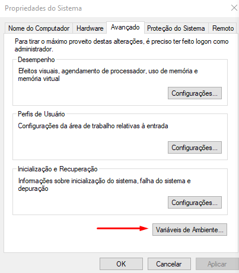
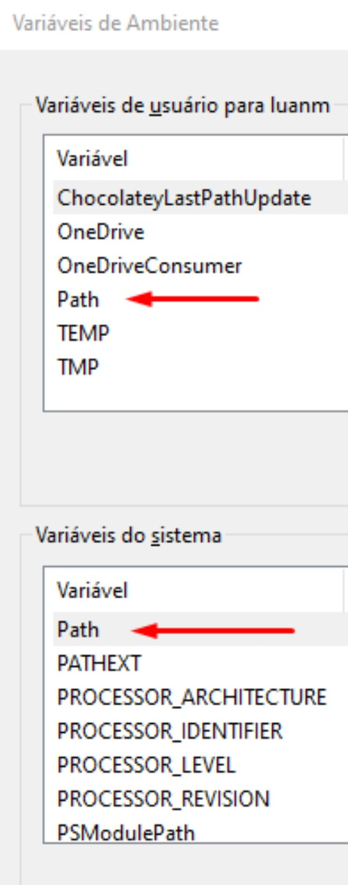

# Allegro no VS Code

<h3> Esse é pra galerinha que quer usar o Allegro no VS Code e percebeu que não existe tutorial pra isso em lugar algum. </h3>

Foram testadas apenas essas versões dos arquivos, então se funcionar com outra dê um feedback. Agradecimento ao Rafael Campos que descobriu como fazer isso funcionar e tirou um tempo pra me ensinar.

-------------------------------------------------------------------------------------------------------

 ## Instalar o MINGW

- Para instalar o MINGW só precisa dar um Crtl + click neste <a href="https://sourceforge.net/projects/mingw-w64/files" target="blank" >link</a> de download para ser direcionado ao SourceForge. 
- Após isso, procure o arquivo do MINGW com nome de <b> "x86_64-posix-seh" </b> e clique para download. 
- Agora é ir em Propriedades do Sistema, em Variáveis de Ambiente e adicionar o caminho que foi instalado o MINGW, na váriavel Path, tanto para as Váriaveis de usuário quando para as Váriaveis de sistema. 

 
    
    

## Instalar o Allegro

- Para instalar o Allegro correto, de um Crtl + click este <a href="https://github.com/liballeg/allegro5/releases" target="blank" >link</a> e procure a versão 5.2.8 com nome: <b> "allegro-x86_64-w64-mingw32-gcc-12.1.0-posix-seh-dynamic-5.2.8.0.zip </b>. Feito isso, descompacte o arquivo e abra a pasta "allegro" dentro dele.
- Feito isso, abra também a pasta que foi instalado o MINGW e copie as pastas bin, include e lib do diretório do allegro para dentro da pasta com nome "mingw64". Dentro desse mesmo diretório abra a pasta "x86_64-w64-mingw32" e cole as pastas bin, include e lib de novo. 

 
    

